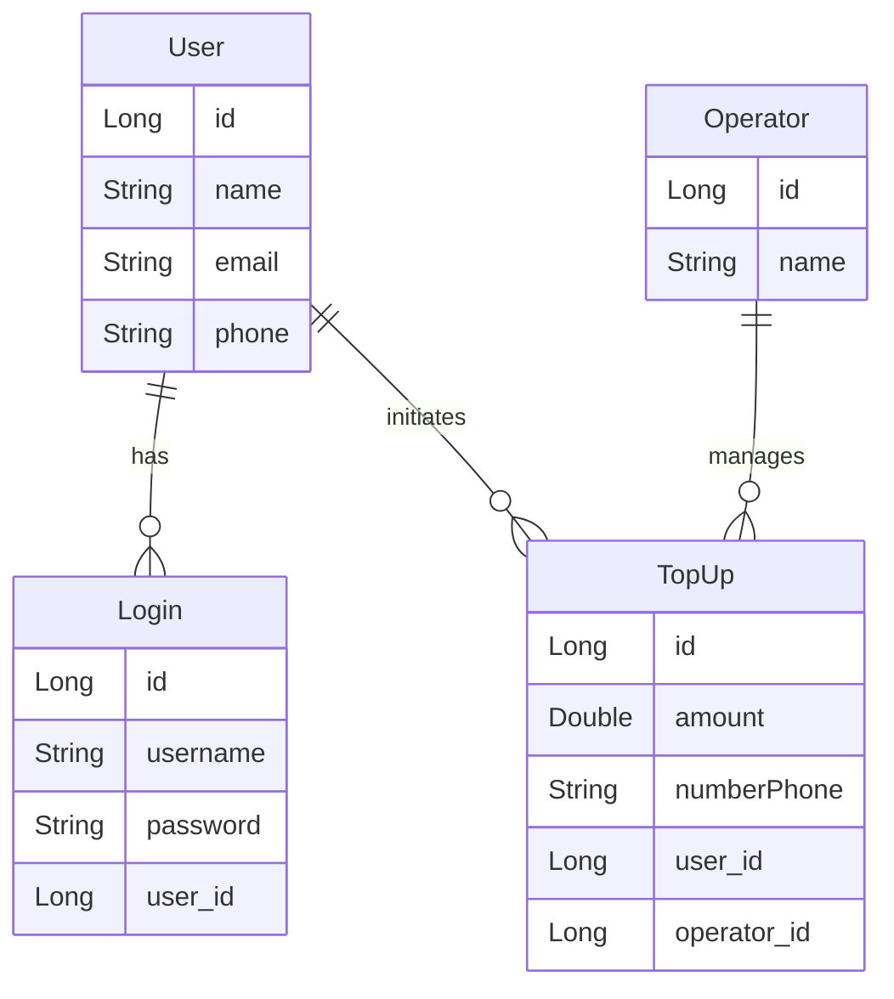
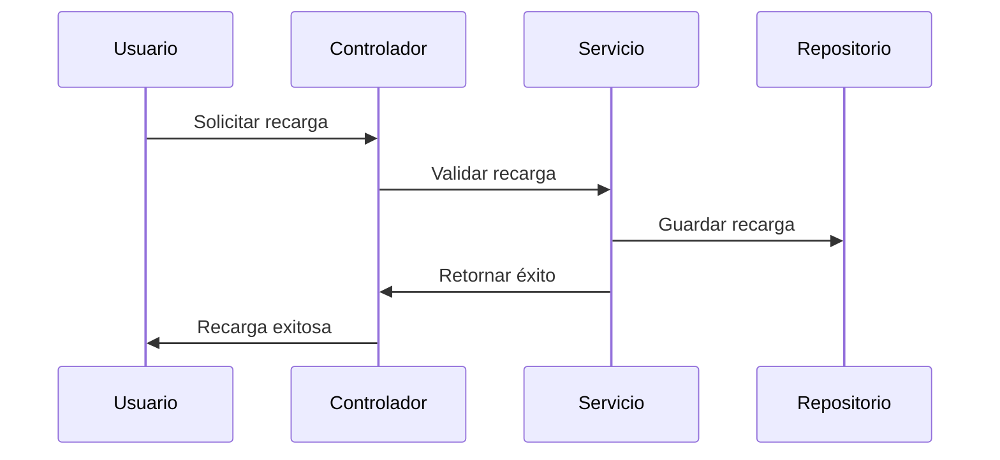
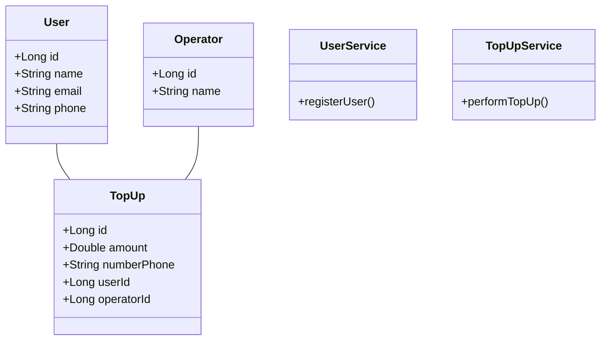

# Top-ups Service

Este proyecto es un sistema de recargas en línea que ofrece una API para gestionar operadores, usuarios, y recargas de saldo. El servicio está construido en **Java** utilizando el framework **Spring Boot**, con un enfoque modular y siguiendo los principios de **Clean Architecture** y **DDD (Domain Driven Design)**. También se implementan pruebas unitarias con **JUnit** y **Mockito** para garantizar la robustez del sistema.

## Índice

- [Arquitectura del Proyecto](#arquitectura-del-proyecto)
- [Patrones Utilizados](#patrones-utilizados)
- [Cobertura de Pruebas](#cobertura-de-pruebas)
- [Diagramas](#diagramas)
    - [Diagrama Relacional](#diagrama-relacional)
    - [Diagrama de Casos de Uso](#diagrama-de-casos-de-uso)
    - [Diagrama de Secuencia](#diagrama-de-secuencia)
    - [Diagrama de Clases](#diagrama-de-clases)
- [Cómo Ejecutar el Proyecto](#cómo-ejecutar-el-proyecto)

## Arquitectura del Proyecto

El proyecto sigue una arquitectura hexagonal que separa la lógica del dominio de los detalles de infraestructura. Está dividido en varias capas:

1. **Domain Layer**: Contiene las entidades (`User`, `Operator`, `TopUp`) y sus respectivos repositorios. Esta capa define el núcleo del sistema.
2. **Application Layer**: Define los casos de uso del sistema, como el registro de usuarios, la ejecución de recargas y la gestión de operadores.
3. **Infrastructure Layer**: Maneja las implementaciones concretas de los repositorios y la integración con frameworks externos, como JPA y Spring Security.
4. **Web Layer**: Exposición de la API REST a través de controladores que manejan las solicitudes HTTP.

### Estructura del Proyecto

```
src/
├── main/
│   ├── java/
│   │   └── com.example.topups/
│   │       ├── application/            # Casos de uso y puertos
│   │       ├── domain/                 # Entidades y repositorios de dominio
│   │       ├── infrastructure/         # Adaptadores y configuración de infraestructura
│   │       └── controllers/            # Controladores REST y DTOs
│   └── resources/
└── test/                               # Pruebas unitarias y de integración
```

## Patrones Utilizados

- **Clean Architecture**: Estructura del código que separa las preocupaciones en capas, permitiendo que la lógica del dominio esté desacoplada de los detalles de la infraestructura.
- **Domain-Driven Design (DDD)**: Las entidades y servicios están modelados siguiendo los principios de DDD, lo que garantiza que el sistema esté alineado con los procesos de negocio.
- **DTOs (Data Transfer Objects)**: Para transferir datos entre el cliente y el servidor sin exponer las entidades de dominio directamente.
- **Inyección de Dependencias**: Utilizada ampliamente con `@Autowired` y en los constructores de los servicios, lo que facilita la prueba y el mantenimiento.
- **JwtUtil**: Para la gestión de autenticación y generación de tokens JWT.

## Cobertura de Pruebas

El proyecto cuenta con una amplia gama de pruebas unitarias y de integración. Se utilizan **JUnit** y **Mockito** para crear pruebas efectivas que validan tanto la lógica del negocio como la interacción con las capas de infraestructura.

### Pruebas Implementadas:

- **UserServiceTest**: Pruebas para la lógica de registro de usuarios, incluyendo validaciones de duplicados y encriptación de contraseñas.
- **OperatorServiceTest**: Verifica la adición de operadores y la consulta de operadores registrados.
- **TopUpServiceTest**: Valida la ejecución de recargas y las consultas de recargas por usuario u operador.
- **Controladores**: Cada controlador tiene pruebas unitarias y de integración para verificar la correcta interacción con los casos de uso.

**Cobertura estimada:** 85%

## Diagramas

### Diagrama Relacional



### Diagrama de Casos de Uso

```mermaid
usecaseDiagram
    actor Usuario    

    Usuario --> (Iniciar Sesión)
    Usuario --> (Registrar Usuario)
    Usuario --> (Realizar Recarga)
    Usuario --> (Administrar Operadores)
```

### Diagrama de Secuencia



### Diagrama de Clases



## Cómo Ejecutar el Proyecto

### Requisitos

- **Java 17**
- **Gradle**
- **Postman** o cualquier cliente REST para pruebas
- **H2** o base de datos en memoría (configurado en `application.yml`)

### Pasos para ejecutar

1. **Construir el proyecto**:
   ```bash
   ./gradlew build
   ```

2. **Ejecutar el proyecto**:
   ```bash
   ./gradlew bootRun
   ```

3. **Pruebas**:
   Para ejecutar las pruebas unitarias, utiliza:
   ```bash
   ./gradlew test
   ```

4. **Acceder a la API**:
    - La API estará disponible en `http://localhost:8080/top-up-service`.
    - Prueba los endpoints utilizando Postman u otro cliente.
    - En la carpeta postman se encuentra la collection`top-up-services.postman_collection.json` para realizar cada uno de los request del webservices
